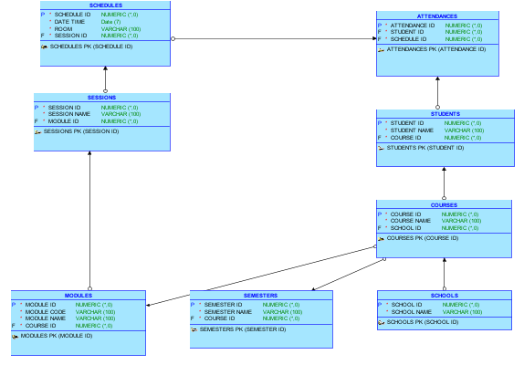

## LOGICAL APPROACH TO DESIGN
At the University , every semester has many sessions attended by students. The university needs a database to store timetables and keep track of students' attendance. The solution to this task is to design a relational database schema. In this proposed database system, the following requirements in the university setting will be addressed:
•	Store comprehensive information regarding the schools within the university.
•	Maintain an up-to-date record of the courses offered by each school, including the course name and duration.
•	Systematically record the semesters in which each course is offered.
•	Keep track of the students enrolled in each course, including their names and identification numbers.
•	Systematically store information about the modules comprising each course, including the module code and name.
•	Accurately record information about the sessions scheduled for each module, including the type of session, the date and time, and the room assigned.
•	Effectively monitor student attendance at each session, enabling the university to evaluate attendance and determine if students have met the attendance requirements for each module.
By providing a comprehensive and integrated solution for managing university operations, this proposed database system will significantly streamline and improve the university management process.

## DATABASE ENTITY RELATIONSHIP 
The database entity relationship was drawn using the Oracle SQL Developer and Data Modeller.
The entity relations diagram for the normalized database is displayed in Figure 1 below. In this design, The "School" table contains information about the different schools within the university, such as the name and location of each school. The courses table stores information about the courses and the relationship between a course and a school is established using the school_id foreign key.

Similarly, the semesters table stores information about semesters and their relationship with courses.  The "Course" table contains information about the courses offered by each school, such as the name and duration of each course. The "Semester" table contains information about the semesters in which each course is offered, such as the start and end dates of each semester. The "Student" table contains information about the students enrolled in each course, such as the students' names and ID numbers. The "Module" table contains information about the modules that make up each course, such as the module code and name.
The "Session" table contains information about the sessions scheduled for each module, such as the type of session (lecture, tutorial, or lab), the date and time of the session, and the room in which the session will be held. The "Attendance" table contains information about which students attended which sessions. This allows the university to track which students have attended each session and determine if they have met the attendance requirements for each module.
In addition, the 'schedules' table represents the sessions/classes that are scheduled for each module in a semester. The table stores information about the date, time, and room that a session is scheduled for, as well as the type of session (lecture, tutorial, or lab). The 'schedules' table has a foreign key relationship with the 'modules' table, indicating that a schedule belongs to a specific module. Additionally, the 'schedules' table has a many-to-many relationship with the 'attendance' table, as multiple students may attend a single session and a single student may attend multiple sessions. By including the 'schedules' table in the database, it is possible to track and manage the scheduling and attendance information for each module in a course.
